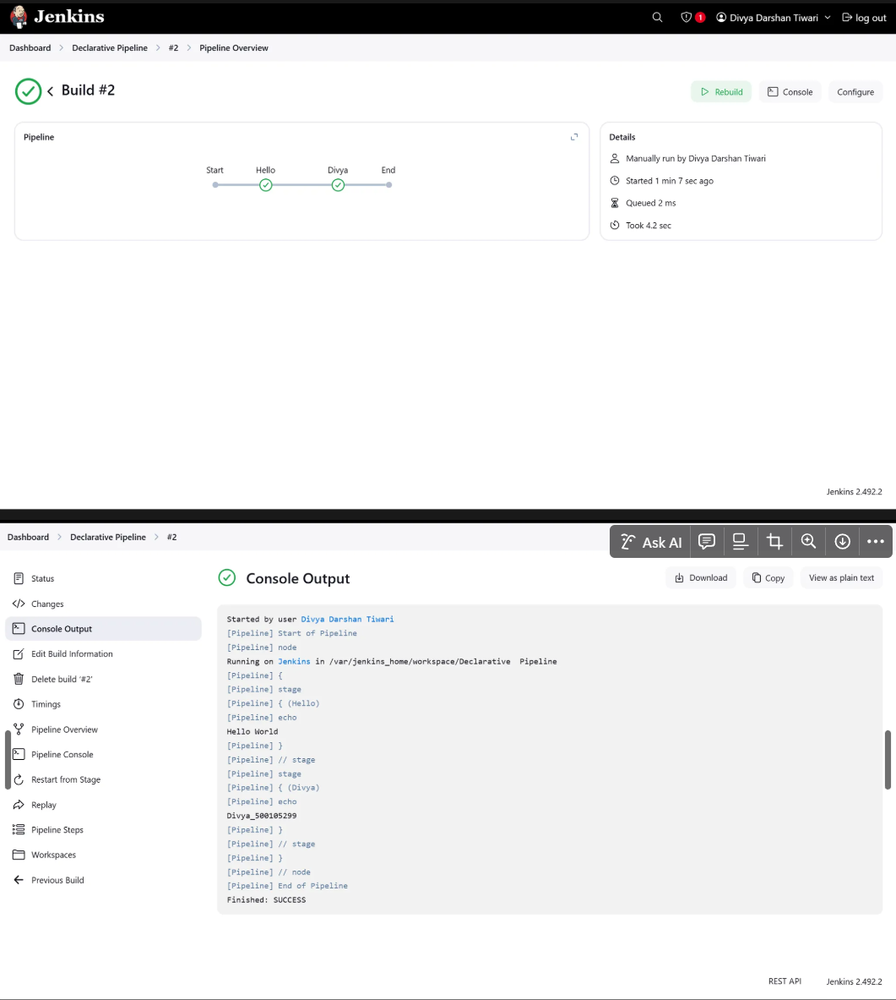

# Lab-7

1. Name- Divya Darshan Tiwari

2. SAP- 500105299

3. Roll No. - R2142220070

4. Batch - B1H Full Stack AI

## Jenkins - CI/CD Automation

---

You are launching a Jenkins instance using Docker with port mappings and volume persistence.

### ⚙️ **How We Did It:**

Run the following Docker command in your terminal:

```bash
bash
CopyEdit
docker run -p 8080:8080 -p 50000:50000 --restart=on-failure -v jenkins_home:/var/jenkins_home jenkins/jenkins
```

### 📌 **Explanation:**

- `p 8080:8080` exposes the Jenkins web UI on localhost:8080.
- `p 50000:50000` is for connecting Jenkins agents (used later).
- `-restart=on-failure` automatically restarts Jenkins if it crashes.
- `v jenkins_home:/var/jenkins_home` mounts a volume for Jenkins data to persist.
- `jenkins/jenkins` is the official Docker image for Jenkins.

### Jenkins not found therefore installing


Password - 5f07be844fd542bfac0c03cdec6ba63a

location of password - /var/jenkins_home/secrets/initialAdminPassword

After this open the open [localhost](http://localhost) on port 8080: then we get a screen for the enter password


Jenkins asks if you want to install **recommended plugins**.

### **How We Did It:**

- Click on **"Install suggested plugins"** when prompted.
  This will install commonly used plugins automatically (like Git, Pipeline, etc.).


You reach the **Jenkins Dashboard** after installation is complete.

### **How We Did It:**

- After plugin installation and creating the first admin user (skipped image), you’re taken to the dashboard.
- From here, you can start creating jobs and pipelines.


You’ve created a **Pipeline job**, and now you click **"Build Now"** to trigger it.

### **How We Did It:**

1. Click **“New Item”**.
2. Enter a name
3. Choose **Pipeline** → Click OK.
4. Scroll down to the **Pipeline** section.
5. Select scripted pipeline
6. remove all the stages except result
7. Next apply and build


now empty result


After clicking on Build Now


Click on hash in the builds box


After clicking on pipelineoverview


**Declarative**


### **How We Did It:**

1. Click **“New Item”**.
2. Enter a name.
3. Choose **Pipeline** → Click OK.
4. Scroll down to the **Pipeline** section.
5. Select the Hello World Option
6. Write a simple script like:

   ```groovy

   pipeline {
       agent any
       stages {
           stage('Hello') {
               steps {
                   echo 'Hello World'
               }
           }
           stage('Divya'){
   		        steps{
   				        echo 'Divya'
           }
       }
   }
   }

   ```

7. Click **Save**.
8. Click **Build Now** to run it.


You’re viewing the **build history** and click on the build number/hash to see the build details

**How We Did It:**

1. On the left side panel, under **Build History**, click on the build number (e.g., `#1`).
2. This shows build logs, status, and options to view the pipeline.



## Creating Pipeline using Jenkins

### **1. Prepare Your Git Repository**

- Make sure your `Jenkinsfile` is pushed to your GitHub or Git repository **in the root directory**.

(https://github.com/DivyaDarshanTiwari/devops-test-automation-jenkinsfile.git)

- Copy the **repository URL** .

### **2. Open Jenkins Dashboard**

- Go to [http://localhost:8080](http://localhost:8080/)
- Login if needed.


### **3. Create a New Item**

1. Click on **“New Item”**.
2. Enter a name .
3. Select **“Pipeline”** as the type.
4. Click **OK**.

### **4. Configure Pipeline to Use SCM**

1. Scroll down to the **Pipeline** section.
2. For **Definition**, select **Pipeline script from SCM**.
3. Under **SCM**, choose **Git**.
4. In **Repository URL**, paste your GitHub repo URL.
   - Configure credentials.
5. In **Script Path**, enter the filename:
   - Default is jenkinsfile or the name you have given .


### **5. Save and Build**

1. Click **Save**.
2. On the project page, click **“Build Now”**.
3. Jenkins will:
   - Clone the repo.
   - Look for `Jenkinsfile`.
   - Execute it step-by-step.


